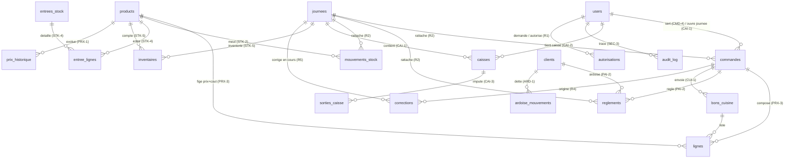

# M1 · Diagramme entité-relation (Mermaid)

```mermaid
erDiagram
    users ||--o{ commandes : "sert (CMD-4) / ouvre journee (CAI-1)"
    users ||--o{ caisses : "tient caisse (CAI-2)"
    users ||--o{ audit_log : "trace (SEC-3)"
    users ||--o{ autorisations : "demande / autorise (R1)"
    journees ||--o{ commandes : "rattache (R2)"
    journees ||--o{ reglements : "rattache (R2)"
    journees ||--o{ mouvements_stock : "rattache (R2)"
    journees ||--o{ caisses : "contient (CAI-1)"
    journees ||--o{ inventaires : "inventorie (STK-5)"
    journees ||--o{ corrections : "corrige en cours (R5)"
    commandes ||--o{ lignes : "compose (PRX-3)"
    commandes ||--o{ reglements : "regle (PAI-2)"
    commandes ||--o{ bons_cuisine : "envoie (CUI-1)"
    commandes ||--o{ corrections : "origine (R4)"
    bons_cuisine ||--o{ lignes : "liste"
    products ||--o{ lignes : "fige prix+cout (PRX-3)"
    products ||--o{ mouvements_stock : "meut (STK-2)"
    products ||--o{ entree_lignes : "entre (STK-4)"
    products ||--o{ inventaires : "compte (STK-5)"
    products ||--o{ prix_historique : "evolue (PRX-1)"
    clients ||--o{ reglements : "ardoise (PAI-2)"
    clients ||--o{ ardoise_mouvements : "dette (ARD-1)"
    entrees_stock ||--o{ entree_lignes : "detaille (STK-4)"
    caisses ||--o{ sorties_caisse : "impute (CAI-3)"
```
